<div align="center">


# HealthConnect

**Healthcare, finally connected.**

One search across every connected pharmacy in Lebanon — with QR prescriptions doctors can
issue in a minute, stock and invoicing pharmacies actually want to use, and a delivery
router that stops sending three drivers to do one trip.

### [**healthconnect.dev →**](https://healthconnect.dev)

[](https://www.djangoproject.com/)
[](https://www.django-rest-framework.org/)
[](https://nextjs.org/)
[](https://www.typescriptlang.org/)
[](https://www.python.org/)
[](apps/web/public/manifest.json)


[Architecture](docs/ARCHITECTURE.md) · [Demo script](docs/DEMO.md) · [API](docs/API.md) · [Setup](docs/SETUP.md) · [Smart features](docs/AI_FEATURES.md) · [Deploy](docs/DEPLOY_AWS.md)

</div>

<br>

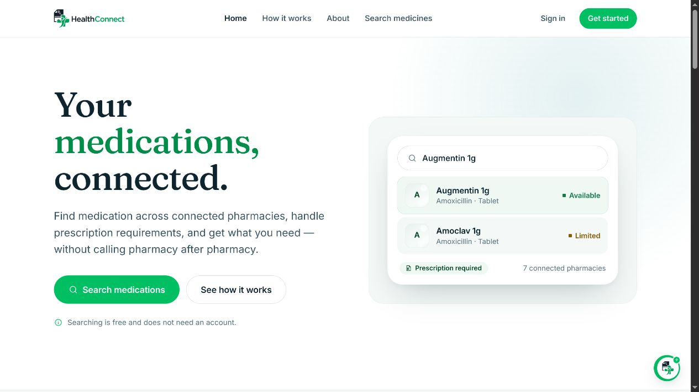

<br>

## The problem

Finding one medicine in Beirut takes five phone calls. Pharmacies can't tell you what the
pharmacy down the street has. Patients carry paper scripts that only one shop can read.
And when an order does span three pharmacies, three drivers make three trips.

HealthConnect connects all four sides — patients, pharmacies, physicians, and drivers —
without asking any pharmacy to throw away the software it already runs.

<br>

## For patients

Search once by brand or generic name and see what is genuinely available across connected
pharmacies, ranked by distance, other shoppers' experience, reliability, and price. Order
across several pharmacies at once, track it to the door, or schedule repeat refills for
chronic medication.

Pharmacies never expose their true stock depth — shoppers see an orderable ceiling only.

| Search across every pharmacy | Availability, pharmacy by pharmacy |
|---|---|
| 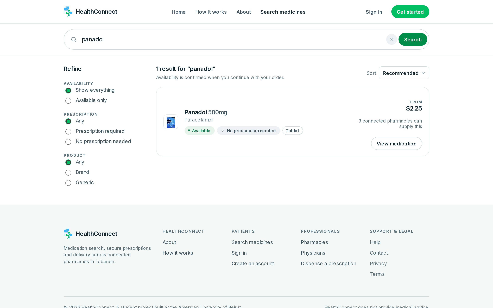 | 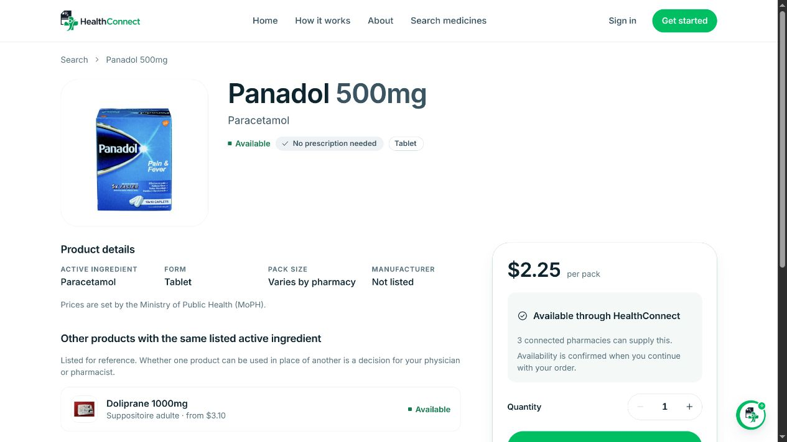 |

| Orders, tracked to the door | |
|---|---|
| 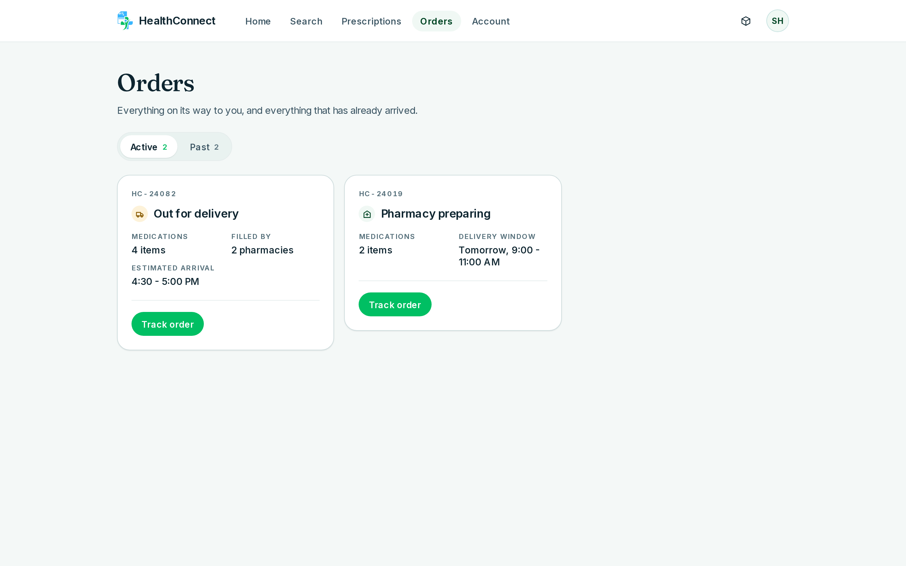 | Multi-pharmacy orders arrive as **one** delivery, with a live status and an arrival window — not one parcel per shop. |

<br>

## For pharmacies

Batch-level stock with FEFO and expiry risk, invoicing, client records with an account
ledger, CSV/Excel import, and analytics built on the metrics operators actually review —
turnover, DIO, GMROI, ABC classification, dead stock, reorder points, and the demand they
*missed*.

| Dashboard | Analytics |
|---|---|
| 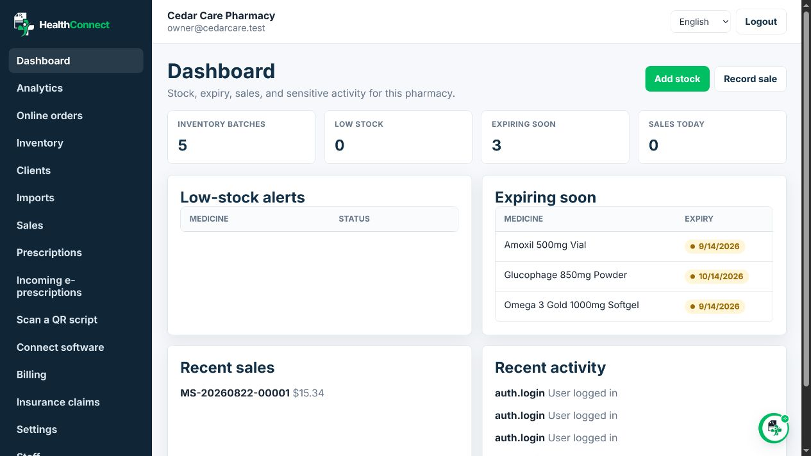 | 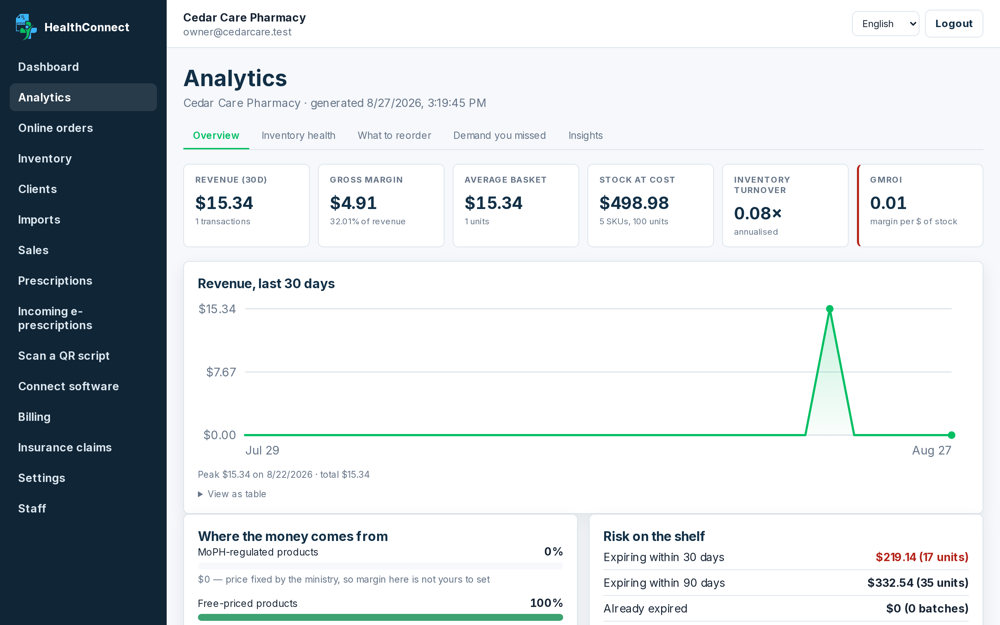 |

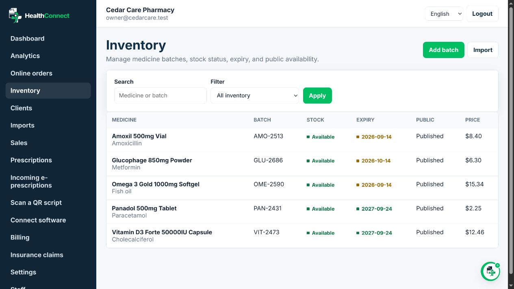

### Onboarding without migration

Pharmacies keep their existing software and their own product codes. A stdlib-only
connector reads whatever their POS can already export and pushes only what changed, over
signed requests. Unknown codes are parked for a one-time mapping, never rejected.

<br>

## For doctors

The Order of Physicians roster is pre-loaded, so activation is a one-minute claim rather
than an onboarding. Prescriptions are emailed to the patient as secure QR codes.

| Write a prescription | Everything you have issued |
|---|---|
| 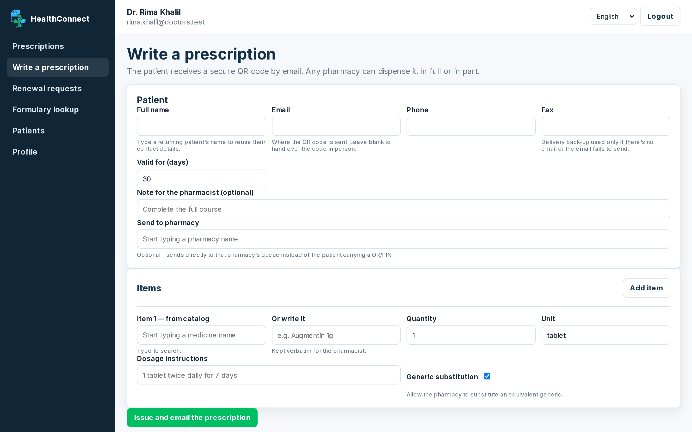 | 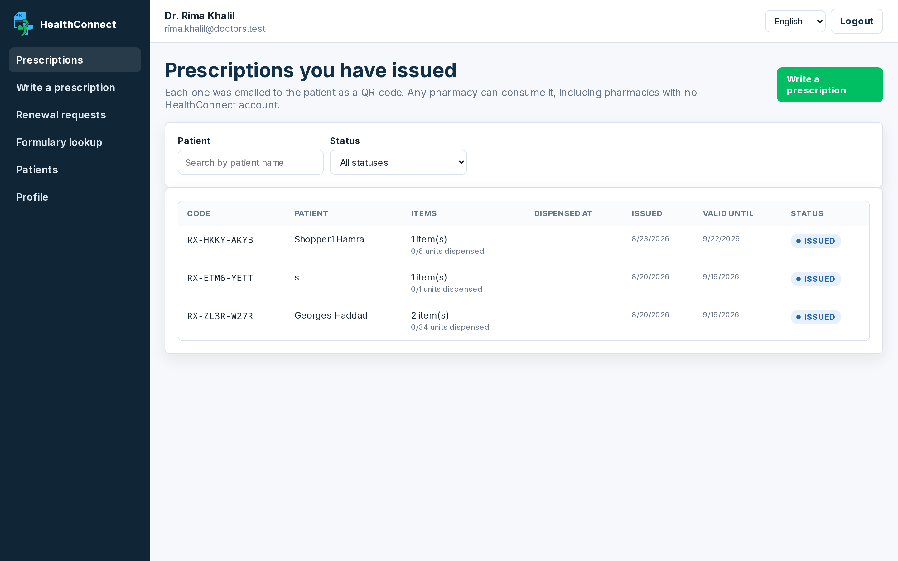 |

<br>

## For any pharmacy, with no account

Scan the patient's QR — or type the code and PIN — at `/rx`, see the items, and dispense in
full or in part. The remainder stays claimable elsewhere, exactly once.

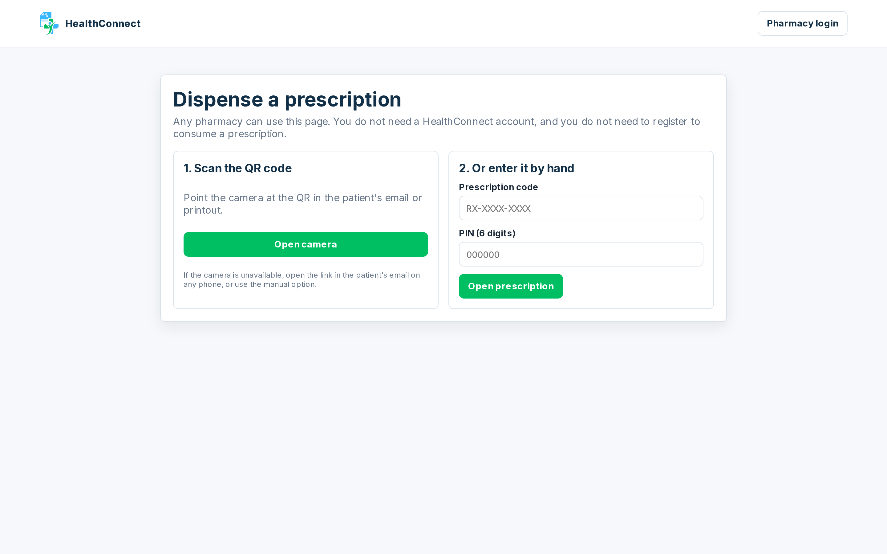

<br>

## Delivery that isn't naive

An order sourced from three pharmacies does not mean one driver touring three shops for one
customer. Orders are batched into routes that **share** pharmacy visits, under real
precedence, capacity, and time-window constraints.

| Dispatch board | Driver console |
|---|---|
| 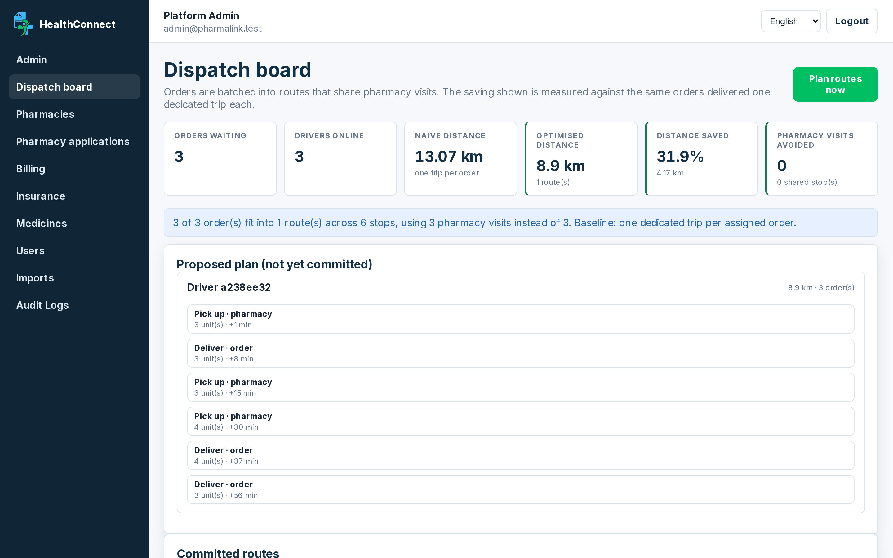 | 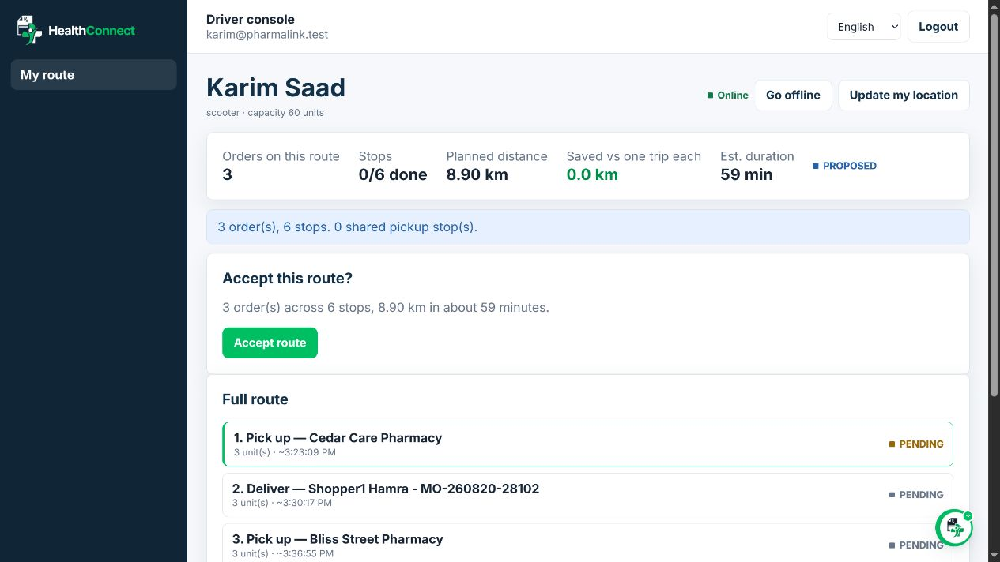 |

On the full `seed_poc` scenario: **6 orders, 1 driver, 13.7 km against a 38.9 km naive
baseline — 65% less driving and 5 pharmacy visits avoided.** (The board above shows a
smaller live batch, so its numbers differ.) See
[the routing section](docs/ARCHITECTURE.md#3-delivery-routing--deliveryservicesroutingpy).

Medicine prices set by the Ministry of Public Health are enforced everywhere a price can be
written; supplements and parapharmacy stay freely priced.

<br>

## Built with

| Layer | Stack |
|---|---|
| **API** | Django 5 · Django REST Framework · PostgreSQL (SQLite for dev) |
| **Web** | Next.js 14 (App Router) · TypeScript · React 18 · PWA |
| **Connector** | Python standard library only — runs on whatever the pharmacy already has |
| **i18n** | English · Arabic · French, with RTL |
| **Deploy** | Docker Compose · AWS Amplify ([guide](docs/DEPLOY_AWS.md)) |

<br>

## Quick start

```bash
cp .env.example .env
docker compose up -d postgres          # or set DJANGO_TEST_SQLITE=1 to skip Postgres
```

**API**

```bash
cd apps/api
python -m venv .venv
./.venv/bin/python -m pip install -r requirements.txt
./.venv/bin/python manage.py migrate
./.venv/bin/python manage.py seed_poc
./.venv/bin/python manage.py runserver 8000
```

**Web**

```bash
cd apps/web
pnpm install
pnpm dev
```

Open <http://localhost:3000> and follow [docs/DEMO.md](docs/DEMO.md).

<details>
<summary><b>Windows (PowerShell)</b></summary>

```powershell
Copy-Item .env.example .env
docker compose up -d postgres

cd apps/api
python -m venv .venv
.\.venv\Scripts\python.exe -m pip install -r requirements.txt
.\.venv\Scripts\python.exe manage.py migrate
.\.venv\Scripts\python.exe manage.py seed_poc
.\.venv\Scripts\python.exe manage.py runserver 8000
```

</details>

`seed_poc` builds a full Beirut scenario — 5 pharmacies with deliberately fragmented stock,
3 doctors, 6 shoppers with orders in every lifecycle state, refill schedules,
e-prescriptions and saved payment methods, and 3 drivers — and prints every login plus a
live prescription code and PIN.

The demo catalogue is **not invented**. `seed_poc` picks 20 real MoPH-registered products
out of whatever `sync_moph_catalog` has loaded, one per active ingredient (see
`SEED_INGREDIENTS`), at their real published prices. Run the catalog sync first — the seed
refuses to guess and will tell you so.

### Demo accounts

All use `Password123!`

| Role | Email |
|---|---|
| Platform admin | `admin@pharmalink.test` |
| Pharmacy owner | `owner@cedarcare.test` |
| Pharmacy staff | `staff@cedarcare.test` |
| Doctor | `rima.khalil@doctors.test` |
| Shopper | `shopper1@pharmalink.test` |
| Driver | `karim@pharmalink.test` |

Two more physicians (`samir.aoun@doctors.test`, `lina.nassar@doctors.test`) are left
unactivated on purpose, to demo the zero-onboarding claim flow.

<br>

## Repository layout

```
apps/api            Django + Django REST Framework
apps/web            Next.js + TypeScript
tools/connector     The agent that runs inside the pharmacy
docs/               Architecture, API, setup, demo script, deployment
```

<br>

## Verification

```bash
cd apps/api
DJANGO_TEST_SQLITE=1 ./.venv/bin/python manage.py test    # 322 tests

cd ../web
pnpm exec tsc --noEmit
pnpm build
```

Django's SQLite backend always runs tests against an in-memory database, so this never
touches your dev data.

## Background jobs

```bash
# Release stale stock holds, generate recurring orders, release scheduled orders,
# and re-plan delivery routes.
./.venv/bin/python manage.py run_scheduler --loop --every 300 --plan
```

<br>

## Non-goals

No diagnosis or treatment advice, no automatic substitution recommendations, no payment
processing or insurance claims, no native mobile app, and no microservices/Kafka/Kubernetes.
Known limitations are listed honestly at the end of
[docs/ARCHITECTURE.md](docs/ARCHITECTURE.md#known-limitations).

<br>

<div align="center">

A student project built at the American University of Beirut.

**HealthConnect does not provide medical advice.**

</div>
